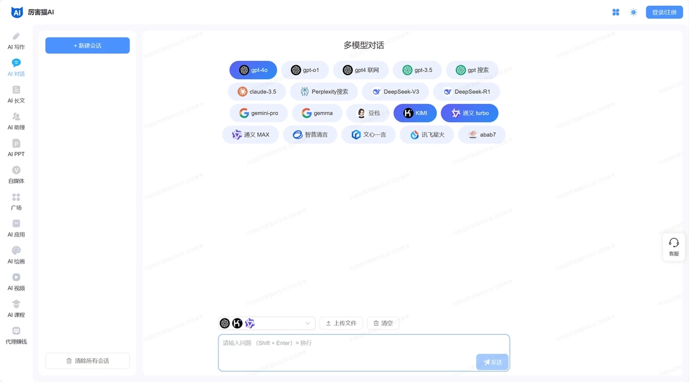

# 20款免费AI搜索引擎实测：告别广告，直达答案

---

当你在传统搜索引擎翻到第三页还没找到想要的答案时，AI搜索已经把结果整理好放在你面前了。2025年的AI搜索不再是简单的关键词匹配游戏——它们能听懂你的问题，理解你的意图，甚至告诉你信息来源是否靠谱。本文实测20款真正免费、零广告的AI搜索工具，覆盖学术研究、代码调试、日常查询等场景，帮你找到最适合自己的那一款。

---

## 讯飞星火

科大讯飞自己做的大模型，1.5万亿参数听起来挺唬人。实际用下来，语音识别确实是强项，说话它都能听懂。支持文本、语音、图像多种输入方式，最近还接入了DeepSeek的深度思考功能。关键是完全免费，不限次数。

**传送入口：** https://ai-to.cn/url/?u=xinghuo

**推荐指数：** ⭐⭐⭐⭐⭐

## AI云原生

这个平台有点像AI工具的超市。ChatGPT、Midjourney、Suno、Claude这些热门工具都能用，省得到处注册账号。新用户送100灵力额度，够你试用一阵子。界面做得挺干净，不会让你找不到想用的功能。

**传送入口：** https://yun2.blueshirtmap.com/pastel#/register?i=mq7KB

**推荐指数：** ⭐⭐⭐⭐

## 豆包AI

字节跳动出品，主打写作辅助。你给个主题，它能帮你列框架、找素材，甚至直接写出完整文章。对于经常要写东西的人来说，这工具能省不少时间。不过生成的内容还是要自己检查修改，别指望它一步到位。

**传送入口：** https://xinghuo.xfyun.cn/desk?ch=xh_mO2xY

**推荐指数：** ⭐⭐⭐⭐⭐

## 秘塔AI搜索

这个搜索引擎的特点是结果特别干净。没有广告，没有乱七八糟的推荐，直接给你答案。它会把搜到的信息整理成结构化的内容，看起来比一堆链接舒服多了。在法律、学术这些专业领域表现不错，[Perplexity](https://pplx.ai/ixkwood69619635)也是类似的思路。

**传送入口：** https://metaso.cn/?s=aito45g&referrer_s=aito45g

**推荐指数：** ⭐⭐⭐⭐⭐

## 厉害猫

一个平台接入了9个大模型，包括GPT3.5、GPT4O、通义千问、Kimi这些。你可以对比不同模型的回答，看看哪个更靠谱。对于喜欢货比三家的人来说，这个设计挺实用。

**传送入口：** https://www.lihaimao.com/?user_sn=22446455

**推荐指数：** ⭐⭐⭐⭐

## 知乎直答

知乎做的AI搜索，最大的优势是能调用知乎社区里的高质量回答。问题比较专业或者需要经验分享的时候，这个工具特别好用。最近接入了满血版DeepSeek，回答质量又提升了一档。支持简略和深入两种模式，赶时间就选简略，想深入了解就选深入。

**传送入口：** 点击前往

**推荐指数：** ⭐⭐⭐⭐⭐

## DeepSeek

国产AI的黑马，对标ChatGPT。最近很火，主要是因为免费无限制使用。实际体验下来，逻辑推理能力确实不错，代码生成也挺靠谱。如果你想找个[免费的ChatGPT替代品](https://pplx.ai/ixkwood69619635)，这个值得试试。

**传送入口：** 点击前往

**推荐指数：** ⭐⭐⭐⭐⭐

## 腾讯元宝

腾讯自己的AI助手，用的是混元大模型和DeepSeek技术。覆盖网页、手机、微信小程序、电脑客户端，基本上你在哪都能用。支持文件解析、内容创作、识图这些功能，满血版DeepSeek R1联网识图效果不错。

**传送入口：** 点击前往

**推荐指数：** ⭐⭐⭐⭐⭐

## 智谱AI搜索

智谱清言推出的搜索产品，响应速度挺快。问题问出去，基本上秒回。答案质量也在线，不会给你一堆废话。适合需要快速获取信息的场景。

**传送入口：** 点击前往

**推荐指数：** ⭐⭐⭐⭐⭐

## Kimi

月之暗面做的AI，中英文对话都很流畅。最大的特点是能读各种文件——TXT、PDF、Word、PPT、Excel都能处理。你把文件扔给它,它能帮你总结要点、回答问题。还有搜索功能，能结合网上的信息给你更全面的答案。目前免费使用。

**传送入口：** 点击前往

**推荐指数：** ⭐⭐⭐⭐⭐

## Phind

专门给程序员用的AI搜索。遇到技术问题，它能直接给你代码片段和解决方案。结合实时网络搜索，答案都是最新的。不用注册就能免费用，对开发者来说很友好。

**传送入口：** 点击前往

**推荐指数：** ⭐⭐⭐⭐⭐

## Hix AI

智能写作工具，支持满血DeepSeek R1和ChatGPT4o。从创意发想到内容优化,整个流程都能帮你搞定。生成的文本结构清晰、逻辑严谨，适合需要大量文字输出的场景。

**传送入口：** 点击前往

**推荐指数：** ⭐⭐⭐⭐⭐

## 纳米AI搜索

360做的搜索引擎，整合了国内16家AI厂商的50多款大模型。你问一个问题，它能调用最合适的模型来回答。从信息检索到内容生成都能做，算是个全能选手。

**传送入口：** 点击前往

**推荐指数：** ⭐⭐⭐⭐

## Consensus

学术搜索引擎，专门从2亿多篇同行评审的科学论文里找答案。做研究、写论文的时候特别有用，能快速找到可靠的学术依据。比自己在数据库里翻文献效率高多了。

**传送入口：** 点击前往

**推荐指数：** ⭐⭐⭐⭐⭐

## Perplexity

对话式搜索引擎，能听懂复杂问题。它会整合实时网络数据和权威来源的信息，直接生成结构化回复。不用你自己去筛选一堆搜索结果，省时省力。如果你想体验更智能的搜索方式，[Perplexity](https://pplx.ai/ixkwood69619635)是个不错的选择。

**传送入口：** 点击前往

**推荐指数：** ⭐⭐⭐⭐

## Felo AI

跨平台智能搜索引擎，深度整合社交网络数据。支持多语言处理，能快速理解你的需求并生成结构化答案。无论是日常查询还是专业领域探索，都能提供实时、多维度的信息。

**传送入口：** 点击前往

**推荐指数：** ⭐⭐⭐⭐⭐

## 华为小艺

华为的智能助手网页版，最近接入了DeepSeek-R1。如果你用华为手机，这个工具能和手机上的小艺无缝衔接。网页版功能也挺全，日常查询、内容创作都能搞定。

**传送入口：** 点击前往

**推荐指数：** ⭐⭐⭐⭐

## 文心一言

百度的生成式AI产品，基于深度学习和自然语言处理技术。能完成内容创作、信息分析、逻辑推理等任务。作为国内最早的一批AI产品，功能已经比较成熟了。

**传送入口：** 点击前往

**推荐指数：** ⭐⭐⭐⭐

## 问小白

北京元石科技做的AI助手，接入了DeepSeek-R1 671b满血版模型。最大的优点是响应速度快，免费无限制使用，不用担心服务器繁忙。支持网页端、iOS和Android应用，已经通过应用商店审核备案，用起来比较放心。

**传送入口：** 点击前往

**推荐指数：** ⭐⭐⭐⭐⭐

## 通义千问

阿里巴巴的智能AI助手，提供自然语言对话、文本生成、代码编写、多语言翻译等服务。支持跨行业场景化定制，在金融文档分析、智能客服、编程辅助等垂直领域表现不错。

---

## 写在最后

这20款AI搜索工具各有特色——有的擅长学术研究，有的专注代码生成，有的在日常查询上更顺手。选哪个取决于你的具体需求。如果你需要一个能理解复杂问题、整合多源信息、提供可靠答案的工具，[Perplexity](https://pplx.ai/ixkwood69619635)这类对话式AI搜索引擎值得一试。它们的核心优势在于把搜索和理解结合起来，让你不用在一堆链接里翻来翻去找答案。
